<div align="center">



<a href="https://git.io/typing-svg">
  
</a>

<br/>

<a href="https://www.linkedin.com/in/davi-bernardo-souza-95243532b"></a>
<a href="mailto:davibernardosouza@gmail.com"></a>


</div>

---

### 🪐 Sobre mim

```java
public class Bernardo {
    String nome       = "Davi Bernardo de Souza Gabriel";
    String base       = "Vale do Aço, MG 🇧🇷";
    String estudando  = "Ciência da Computação @ Unileste";
    String foco       = "Backend com Java & Spring Boot";
    String empresa    = "Event Horizon Tech — sites para negócios locais";
    String[] curto    = {"Física", "Astrofísica", "Escrever"};
    String objetivo   = "Construir sistemas que aguentem a gravidade de produção 🕳️";
}
```

### 🛠️ Arsenal

<div align="center">


</div>

### 📊 Telemetria da nave

<div align="center">


</div>

### 🐍 Devorando contribuições

<div align="center">

<picture>
  <source media="(prefers-color-scheme: dark)" srcset="https://raw.githubusercontent.com/BernardodoJAVAKKj/BernardodoJAVAKKj/output/github-snake-dark.svg"/>
  
</picture>

</div>

---

<div align="center">
  <sub>🌌 "Além do horizonte de eventos, nada escapa — nem os bugs." 🌌</sub>
</div>
